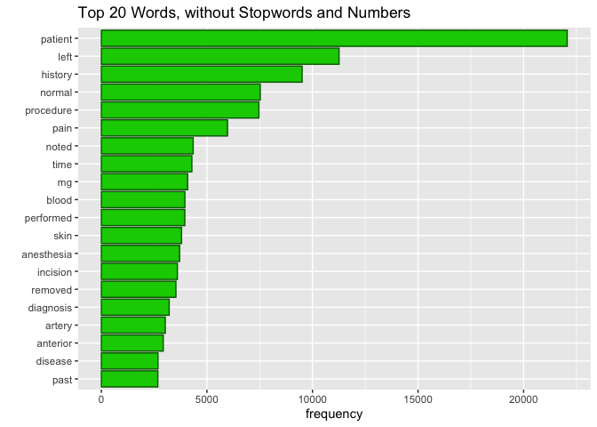

### Read in Data

```r
fn <- "mtsamples.csv"
if (!file.exists(fn))
  download.file("https://raw.githubusercontent.com/USCbiostats/data-science-data/master/00_mtsamples/mtsamples.csv", destfile = fn)
mtsamples <- read.csv(fn)
##convert data frame into tibble
mtsamples <- as_tibble(mtsamples)
head(mtsamples)
```

```
## # A tibble: 6 × 6
##       X description    medical_specialty sample_name  transcription   keywords  
##   <int> <chr>          <chr>             <chr>        <chr>           <chr>     
## 1     0 " A 23-year-o… " Allergy / Immu… " Allergic … "SUBJECTIVE:, … "allergy …
## 2     1 " Consult for… " Bariatrics"     " Laparosco… "PAST MEDICAL … "bariatri…
## 3     2 " Consult for… " Bariatrics"     " Laparosco… "HISTORY OF PR… "bariatri…
## 4     3 " 2-D M-Mode.… " Cardiovascular… " 2-D Echoc… "2-D M-MODE: ,… "cardiova…
## 5     4 " 2-D Echocar… " Cardiovascular… " 2-D Echoc… "1.  The left … "cardiova…
## 6     5 " Morbid obes… " Bariatrics"     " Laparosco… "PREOPERATIVE … "bariatri…
```
## Question 1
### What specialties do we have?
There are 40 specialties in total within this dataset. The specialties do not seem to be evenly distributed: surgery, cardiovascular, consult, and orthopedic have the most amount of entries.

```r
mtsamples %>% count(medical_specialty)
```

```
## # A tibble: 40 × 2
##    medical_specialty                 n
##    <chr>                         <int>
##  1 " Allergy / Immunology"           7
##  2 " Autopsy"                        8
##  3 " Bariatrics"                    18
##  4 " Cardiovascular / Pulmonary"   372
##  5 " Chiropractic"                  14
##  6 " Consult - History and Phy."   516
##  7 " Cosmetic / Plastic Surgery"    27
##  8 " Dentistry"                     27
##  9 " Dermatology"                   29
## 10 " Diets and Nutritions"          10
## # … with 30 more rows
```

```r
ggplot(data = mtsamples) +
  geom_bar(mapping= aes(y = medical_specialty), color = 'darkgreen',fill = 'green3')
```

<!-- -->

## Question 2
### Tokenize the words in the `transcription` column. Count the number of times each token appears. Visualize the top 20 most frequent words.
Not surprisingly, the majority of the top 20 most frequent words are stop words. The one that stands out is the word *patient*.

```r
mtsamples %>% unnest_tokens(token, transcription) %>% count(token, sort = TRUE) %>% top_n(20, n) %>% ggplot(aes(x = n, y = fct_reorder(token, n ))) + 
  geom_col(color = 'darkgreen', fill = 'green3') +
  labs(title = "Top 20 words", y = "", x = "frequency")
```

<!-- -->

## Question 3

### Redo visualization but remove stopwords as well as numbers.
Now we can see more terms that are related to this dataset.


```r
mtsamples %>%
  unnest_tokens(token, transcription) %>%
  count(token, sort = TRUE) %>% 
  anti_join(stop_words, by = c("token" = "word")) %>% 
  filter(!grepl("^[0-9]+$", x = token)) %>%
  top_n(20, n) %>% 
  ggplot(aes(x = n, y = fct_reorder(token, n ))) + 
    geom_col(color = 'darkgreen', fill = 'green3') +
    labs(title = "Top 20 Words, without Stopwords and Numbers", y = "", x = "frequency")
```

<!-- -->

## Question 4
### Repeat question 2, but this time tokenize into bi-grams.
A lot of these contain stop-words, so this is not very informative.

```r
mtsamples %>% unnest_ngrams(ngram, transcription, n = 2) %>% 
  count(ngram, sort = TRUE) %>%
  top_n(20, n) %>%
  ggplot(aes(x = n, y = fct_reorder(ngram, n))) +
  geom_col(color = 'darkgreen', fill = 'green3') +
  labs(title = "Top 20 Bi-grams", y = "", x = "frequency")
```

<!-- -->
### How does the result change if you look at tri-grams?
The top bi-gram *the patient* appears in the top two tri-grams. Some of the other top bi-grams (of the, in the, to the) don't show up as frequently because they are likely being used with a variety of words before/after them. These tri-grams are more unique than the list of bi-grams in containing words that are medical-related.
The frequencies between these two graphs is also very different. The top bi-gram has a frequency of over 20,000 while the top tri-gram has a frequency of approximately 6000.

```r
mtsamples %>% unnest_ngrams(ngram, transcription, n = 3) %>% 
  count(ngram, sort = TRUE) %>%
  top_n(20, n) %>%
  ggplot(aes(x = n, y = fct_reorder(ngram, n))) +
  geom_col(color = 'darkgreen', fill = 'green3') +
  labs(title = "Top 20 Tri-grams", y = "", x = "frequency")
```

<!-- -->

## Question 5
### Using the results you got from questions 4. Pick a word and count the words that appears after and before it.
Picking word *patient*

```r
patient <- mtsamples %>% unnest_ngrams(ngram, transcription, n = 2) %>% 
  separate(ngram, into = c("word1", "word2"), sep = " ") %>%
  select(word1, word2) %>%
  filter(word1 == "patient" | word2 == "patient")
```


```r
##Remove stop words and numbers
patient %>%
  filter(word1 == "patient") %>%
  filter(!(word2 %in% stop_words$word) & !grepl("^[0-9]+$", x = word2)) %>%
  count(word2, sort = TRUE) %>%
  top_n(20, n) %>% knitr::kable(caption = "Words after patient")
```


Table: Words after patient

|word2        |   n|
|:------------|---:|
|tolerated    | 994|
|denies       | 552|
|underwent    | 180|
|received     | 160|
|reports      | 155|
|understood   | 113|
|lives        |  81|
|admits       |  69|
|appears      |  68|
|including    |  67|
|denied       |  62|
|reported     |  58|
|remained     |  56|
|understands  |  51|
|subsequently |  49|
|stated       |  46|
|continued    |  38|
|returned     |  38|
|agreed       |  36|
|continues    |  35|

```r
patient %>%
  filter(word2 == "patient") %>%
  filter(!(word1 %in% stop_words$word) & !grepl("^[0-9]+$", word1)) %>%
  count(word1, sort = TRUE) %>%
  top_n(20, n) %>% knitr::kable(caption = "Words before patient")
```


Table: Words before patient

|word1        |   n|
|:------------|---:|
|history      | 101|
|procedure    |  32|
|female       |  26|
|sample       |  23|
|male         |  22|
|illness      |  16|
|plan         |  16|
|indications  |  15|
|allergies    |  14|
|correct      |  11|
|detail       |  11|
|normal       |  10|
|exam         |   9|
|lbs          |   9|
|instructions |   8|
|minutes      |   8|
|recommend    |   8|
|systems      |   8|
|day          |   7|
|digits       |   7|
|subjective   |   7|

## Question 6
### Which words are most used in each of the specialties. you can use group_by() and top_n() from dplyr to have the calculations be done within each specialty. Remember to remove stopwords. How about the 5 most used words?
The table below shows the top 5 words per medical specialty. Some specialties, such as Allergy / Immunology, have ties in the ranking and, therefore, more than five rows are shown.

```r
mtsamples %>% group_by(medical_specialty) %>%
  unnest_tokens(token, transcription) %>% 
  count(token, sort = TRUE) %>% 
  anti_join(stop_words, by = c("token" = "word")) %>% 
  filter(!grepl("^[0-9]+$", x = token)) %>%
  top_n(5, n) %>%
  arrange(medical_specialty, desc(n)) %>% knitr::kable()
```


|medical_specialty             |token        |    n|
|:-----------------------------|:------------|----:|
|Allergy / Immunology          |history      |   38|
|Allergy / Immunology          |noted        |   23|
|Allergy / Immunology          |patient      |   22|
|Allergy / Immunology          |allergies    |   21|
|Allergy / Immunology          |nasal        |   13|
|Allergy / Immunology          |past         |   13|
|Autopsy                       |left         |   83|
|Autopsy                       |inch         |   59|
|Autopsy                       |neck         |   55|
|Autopsy                       |anterior     |   47|
|Autopsy                       |body         |   40|
|Bariatrics                    |patient      |   62|
|Bariatrics                    |history      |   50|
|Bariatrics                    |weight       |   36|
|Bariatrics                    |surgery      |   34|
|Bariatrics                    |gastric      |   30|
|Cardiovascular / Pulmonary    |left         | 1550|
|Cardiovascular / Pulmonary    |patient      | 1516|
|Cardiovascular / Pulmonary    |artery       | 1085|
|Cardiovascular / Pulmonary    |coronary     |  681|
|Cardiovascular / Pulmonary    |history      |  654|
|Chiropractic                  |pain         |  187|
|Chiropractic                  |patient      |   85|
|Chiropractic                  |dr           |   66|
|Chiropractic                  |history      |   56|
|Chiropractic                  |left         |   54|
|Consult - History and Phy.    |patient      | 3046|
|Consult - History and Phy.    |history      | 2820|
|Consult - History and Phy.    |normal       | 1368|
|Consult - History and Phy.    |pain         | 1153|
|Consult - History and Phy.    |mg           |  908|
|Cosmetic / Plastic Surgery    |patient      |  116|
|Cosmetic / Plastic Surgery    |procedure    |   98|
|Cosmetic / Plastic Surgery    |breast       |   95|
|Cosmetic / Plastic Surgery    |skin         |   88|
|Cosmetic / Plastic Surgery    |incision     |   67|
|Dentistry                     |patient      |  195|
|Dentistry                     |tooth        |  108|
|Dentistry                     |teeth        |  104|
|Dentistry                     |left         |   94|
|Dentistry                     |procedure    |   82|
|Dermatology                   |patient      |  101|
|Dermatology                   |skin         |  101|
|Dermatology                   |cm           |   77|
|Dermatology                   |left         |   58|
|Dermatology                   |procedure    |   44|
|Diets and Nutritions          |patient      |   43|
|Diets and Nutritions          |weight       |   40|
|Diets and Nutritions          |carbohydrate |   37|
|Diets and Nutritions          |day          |   28|
|Diets and Nutritions          |food         |   27|
|Diets and Nutritions          |plan         |   27|
|Discharge Summary             |patient      |  672|
|Discharge Summary             |discharge    |  358|
|Discharge Summary             |mg           |  301|
|Discharge Summary             |history      |  208|
|Discharge Summary             |hospital     |  183|
|Emergency Room Reports        |patient      |  685|
|Emergency Room Reports        |history      |  356|
|Emergency Room Reports        |pain         |  273|
|Emergency Room Reports        |normal       |  255|
|Emergency Room Reports        |denies       |  149|
|Endocrinology                 |thyroid      |  129|
|Endocrinology                 |patient      |  121|
|Endocrinology                 |left         |   63|
|Endocrinology                 |history      |   57|
|Endocrinology                 |dissection   |   45|
|Endocrinology                 |gland        |   45|
|Endocrinology                 |nerve        |   45|
|ENT - Otolaryngology          |patient      |  415|
|ENT - Otolaryngology          |nasal        |  281|
|ENT - Otolaryngology          |left         |  219|
|ENT - Otolaryngology          |ear          |  182|
|ENT - Otolaryngology          |procedure    |  181|
|Gastroenterology              |patient      |  872|
|Gastroenterology              |procedure    |  470|
|Gastroenterology              |history      |  341|
|Gastroenterology              |normal       |  328|
|Gastroenterology              |colon        |  240|
|General Medicine              |patient      | 1356|
|General Medicine              |history      | 1027|
|General Medicine              |normal       |  717|
|General Medicine              |pain         |  567|
|General Medicine              |mg           |  503|
|Hematology - Oncology         |patient      |  316|
|Hematology - Oncology         |history      |  290|
|Hematology - Oncology         |left         |  187|
|Hematology - Oncology         |mg           |  107|
|Hematology - Oncology         |mass         |   97|
|Hospice - Palliative Care     |patient      |   43|
|Hospice - Palliative Care     |mg           |   28|
|Hospice - Palliative Care     |history      |   27|
|Hospice - Palliative Care     |daughter     |   22|
|Hospice - Palliative Care     |family       |   19|
|Hospice - Palliative Care     |pain         |   19|
|IME-QME-Work Comp etc.        |pain         |  152|
|IME-QME-Work Comp etc.        |patient      |  106|
|IME-QME-Work Comp etc.        |dr           |   82|
|IME-QME-Work Comp etc.        |injury       |   81|
|IME-QME-Work Comp etc.        |left         |   70|
|Lab Medicine - Pathology      |cm           |   35|
|Lab Medicine - Pathology      |tumor        |   35|
|Lab Medicine - Pathology      |lymph        |   30|
|Lab Medicine - Pathology      |lobe         |   29|
|Lab Medicine - Pathology      |upper        |   20|
|Letters                       |pain         |   80|
|Letters                       |abc          |   71|
|Letters                       |patient      |   65|
|Letters                       |normal       |   53|
|Letters                       |dr           |   46|
|Nephrology                    |patient      |  348|
|Nephrology                    |renal        |  257|
|Nephrology                    |history      |  160|
|Nephrology                    |kidney       |  144|
|Nephrology                    |left         |  132|
|Neurology                     |left         |  672|
|Neurology                     |patient      |  648|
|Neurology                     |normal       |  485|
|Neurology                     |history      |  429|
|Neurology                     |time         |  278|
|Neurosurgery                  |patient      |  374|
|Neurosurgery                  |c5           |  289|
|Neurosurgery                  |c6           |  266|
|Neurosurgery                  |procedure    |  247|
|Neurosurgery                  |left         |  222|
|Obstetrics / Gynecology       |patient      |  628|
|Obstetrics / Gynecology       |uterus       |  317|
|Obstetrics / Gynecology       |procedure    |  301|
|Obstetrics / Gynecology       |incision     |  293|
|Obstetrics / Gynecology       |normal       |  276|
|Office Notes                  |normal       |  230|
|Office Notes                  |negative     |  193|
|Office Notes                  |patient      |   94|
|Office Notes                  |history      |   76|
|Office Notes                  |noted        |   60|
|Ophthalmology                 |eye          |  456|
|Ophthalmology                 |patient      |  258|
|Ophthalmology                 |procedure    |  176|
|Ophthalmology                 |anterior     |  150|
|Ophthalmology                 |chamber      |  149|
|Orthopedic                    |patient      | 1711|
|Orthopedic                    |left         |  998|
|Orthopedic                    |pain         |  763|
|Orthopedic                    |procedure    |  669|
|Orthopedic                    |lateral      |  472|
|Pain Management               |patient      |  236|
|Pain Management               |procedure    |  197|
|Pain Management               |needle       |  156|
|Pain Management               |injected     |   76|
|Pain Management               |pain         |   76|
|Pediatrics - Neonatal         |patient      |  247|
|Pediatrics - Neonatal         |history      |  235|
|Pediatrics - Neonatal         |normal       |  155|
|Pediatrics - Neonatal         |child        |   82|
|Pediatrics - Neonatal         |mom          |   82|
|Physical Medicine - Rehab     |patient      |  220|
|Physical Medicine - Rehab     |left         |  104|
|Physical Medicine - Rehab     |pain         |   95|
|Physical Medicine - Rehab     |motor        |   62|
|Physical Medicine - Rehab     |history      |   54|
|Podiatry                      |foot         |  232|
|Podiatry                      |patient      |  231|
|Podiatry                      |left         |  137|
|Podiatry                      |tendon       |   98|
|Podiatry                      |incision     |   96|
|Psychiatry / Psychology       |patient      |  532|
|Psychiatry / Psychology       |history      |  344|
|Psychiatry / Psychology       |mg           |  183|
|Psychiatry / Psychology       |mother       |  164|
|Psychiatry / Psychology       |reported     |  141|
|Radiology                     |left         |  701|
|Radiology                     |normal       |  644|
|Radiology                     |patient      |  304|
|Radiology                     |exam         |  302|
|Radiology                     |mild         |  242|
|Rheumatology                  |history      |   50|
|Rheumatology                  |patient      |   34|
|Rheumatology                  |mg           |   26|
|Rheumatology                  |pain         |   23|
|Rheumatology                  |day          |   22|
|Rheumatology                  |examination  |   22|
|Rheumatology                  |joints       |   22|
|Sleep Medicine                |sleep        |  143|
|Sleep Medicine                |patient      |   69|
|Sleep Medicine                |apnea        |   35|
|Sleep Medicine                |activity     |   31|
|Sleep Medicine                |stage        |   29|
|SOAP / Chart / Progress Notes |patient      |  537|
|SOAP / Chart / Progress Notes |mg           |  302|
|SOAP / Chart / Progress Notes |history      |  254|
|SOAP / Chart / Progress Notes |pain         |  239|
|SOAP / Chart / Progress Notes |blood        |  194|
|Speech - Language             |patient      |  105|
|Speech - Language             |therapy      |   41|
|Speech - Language             |speech       |   35|
|Speech - Language             |patient's    |   28|
|Speech - Language             |evaluation   |   17|
|Speech - Language             |goals        |   17|
|Speech - Language             |term         |   17|
|Speech - Language             |time         |   17|
|Surgery                       |patient      | 4855|
|Surgery                       |left         | 3263|
|Surgery                       |procedure    | 3243|
|Surgery                       |anesthesia   | 1687|
|Surgery                       |incision     | 1641|
|Urology                       |patient      |  776|
|Urology                       |bladder      |  357|
|Urology                       |procedure    |  306|
|Urology                       |left         |  288|
|Urology                       |history      |  196|

## Question 7
### Find your own insight in the data.
The top words that are appearing in each medical specialty make sense, and there are some that show up in many categories, such as *patient*, *history* and *procedure*. *Therapy* is a top word in the *Speech - Language* specialty; *sleep* is the top word in the *Sleep Medicine* category; and *incision* is a top word in the *Surgery* department -- these are all not surprising.

It was interesting that the word *abc* is the second most common word in the *Letters* category. That may be used as a placeholder word.


